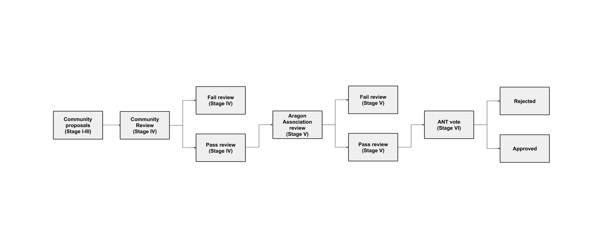

# AGP-1: The Aragon Governance Proposal Process

**Version 1.2**

## What is an AGP?
AGP stands for Aragon Governance Proposal. An AGP is a document that details a change to the management, allocation, or use of shared resources owned or directly influenced by the Aragon Network. All AGPs must be consistent with the goals and values put forth in [AGP-0](AGP-0.md) (the Aragon Manifesto) and compliant with the requirements outlined in this document, AGP-1. The AGP author is responsible for building consensus within the community for their AGP and documenting dissenting opinions.

## AGP process rationale
The purpose of the Aragon Governance Proposal Process ("the AGP process") is to provide a structured process for making changes to the shared resources of the Aragon Network. For these shared resources, governance processes are needed to grant or deny access and approve or reject proposed changes. By creating a fair, lightweight, and transparent AGP process, the AGP-1 authors hope to give ANT holders a meaningful say in the governance of the Aragon Association and the Aragon Network and increase the chances of success for both.

## Proposal workflow
Parties directly involved in the process are the _AGP author_ (you), the _AGP Editors_, the _Aragon Association (“the Association”)_, and _Aragon Network voters_.

Proposals follow this workflow:

* Stage I: Select AGP Track
* Stage II: Pre-proposal
* Stage III: Draft Proposal
* Stage IV: Community Review
* Stage V: Final Proposal
* Stage VI: Aragon Network Vote

During Stage III AGP Editors will review proposals for formatting, legibility, and compliance with AGP-1, referring to AGP-1 as the basis for accepting, denying, or requesting modifications to a proposal. The role of AGP Editors is further described in the AGP Editors section.

At a high level, the AGP-1 workflow looks like this:

### Stage I: Select AGP Track
Before you spend time working on a proposal, make sure the proposal complies with AGP-1 and has a chance of passing review by the AGP Editors and your peers. Review the AGP tracks and their requirements then select the track that you think is best for your proposal. If your proposal meets the requirements, it has a much greater chance of being accepted by AGP Editors and approved by Aragon Network voters.

There are four tracks that an AGP can be categorized into. Select the one you think is best for your AGP:

* Association: proposals for making changes to the Association
* Finance: proposals for transferring funds from the Association multisig
* Meta: proposals for changing AGP-0 or AGP-1 (“changing the way things are changed”)
* Proclamations: proposals for making a public statement on behalf of the Aragon Network

Proposals that cannot be categorized into one of these tracks will likely be denied by AGP Editors. At the discretion of AGP Editors, a proposal may be categorized as “Other” until a new track is approved as part of a Meta AGP.

In addition to the requirement that all AGPs must be consistent with AGP-0, each track has its own requirements for AGPs as follows:

**Association**  
Proposals made to the Association track must affect one or more of the following:

* Association-owned assets, excluding funds held in the [Association multisig](https://wiki.aragon.org/documentation/multisigs/association/)
  * E.g. “Should the Aragon trademark be dedicated to the public domain?”
* Association policies
  * E.g. “Should the Aragon Code of Conduct be updated to include a community-wide ban on Carlos Matos memes?”

**Finance**  
Proposals made to the Finance track must affect the movement of assets held by the [Association multisig](https://wiki.aragon.org/documentation/multisigs/association/). The Association will have discretion over which multisig transfers must go through the AGP process.

* All code and content funded through the AGP process must be released under one of the following licenses:
  * Creative Commons (CC0, CC-BY, CC-SA, CC-BY-SA)
  * GPL
  * AGPL
  * MIT

**Meta**  
Proposals made to the Meta track must affect changes to AGP-0 or AGP-1. The Association has the power to add and remove AGP Editors and fix errata in AGP-0 or AGP-1 on an as-needed basis without going through the AGP process. All other proposals to modify AGP-0 or AGP-1 should be made to the Meta track.
* E.g. “Should the min. acceptance quorum of Aragon Network votes be increased?”

**Proclamations**  
Proposals made to the Proclamations track must be consistent with the Aragon Manifesto.
* E.g. “The Aragon Network declares February 10th to be Aragon Day.”

### Stage II: Pre-proposal
During Stage II you should seek feedback on your AGP idea by sharing it with your peers in the Aragon community and soliciting their feedback. Examples of appropriate venues to share your AGP idea include:

* The [#governance channel](https://aragon.chat/channel/governance) in Aragon Chat
* The [Community category](https://research.aragon.org/c/community) in the Aragon forum
* The [Issues section](https://github.com/aragon/AGPs/issues) of the [AGP repo](https://github.com/aragon/AGPs)

Be open-minded and respectful of all feedback you receive. Adjust your proposal to address serious concerns as they come up to increase the odds of your proposal passing review in later stages.

### Stage III: Draft
After you have asked the Aragon community whether an idea has any chance of support and have received sufficient feedback to feel confident going forward, you can create a draft AGP as a pull request to the AGP repo. Use a template from the Templates section below to ensure you are including all the necessary information. The draft AGP file should be given a temporary name, which the AGP Editor will rename when the AGP is assigned a number.

**Templates**  
Below is a list of AGP templates for each track. Copy the template for the track your AGP is in, fill it out, and submit the pull request with your AGP for review. Sections marked as “required” in the template must be completed. Note that all proposals must be licensed CC-0.

* [Association](../templates/association_template.md)
* [Finance](../templates/finance_template.md)
* [Meta](../templates/meta_template.md)
* [Proclamations](../templates/proclamation_template.md)

To make a Meta track change, you must:

1. Create and submit a pull request changing either AGP-0 or AGP-1.
2. In a _separate_ pull request, create a new file in the AGPs folder of the AGPs repo.
3. Add a link to the pull request created in step 1 to the new file created in step 2.
4. Submit the new file from step 2 as a pull request to the AGPs repo. This will be the AGP pull request. If the AGP is approved by ANT holders, the pull request created in step 1 will be merged. If the proposal is rejected and withdrawn, the pull request created in step 1 will be closed.

### Stage IV: Community Review
After an AGP has been submitted as a draft to the AGPs repo, it must undergo a Community Review period that starts three weeks before the next Aragon Network vote begins and lasts for one week. Draft AGPs must be submitted as a pull request to the AGPs repo before the Community Review period begins to be considered for the next Aragon Network vote. All draft AGPs that have an open pull request at the time the Community Review begins will automatically be moved to Stage IV for consideration.

During the Community Review period, the draft AGP author will have a chance to respond to feedback and make changes to their proposal based on the feedback they have received to increase the likelihood of the proposal passing. At the end of the Community Review period, AGP Editors will perform a final review of the proposal.

* If agreeable, an AGP Editor will assign the AGP a number (generally the PR number related to the AGP). The AGP Editors will not unreasonably deny assigning a number to the AGP.
* Reasons for denying an AGP number and closing the pull request include being too unfocused, too broad, duplication of effort, being technically unsound, not providing proper motivation or addressing concerns by reviewers, or not in compliance with AGP-1.

After a proposal in Stage IV has been thoroughly reviewed, you may finalize your proposal and request that an AGP Editor moves the proposal from Stage IV to Stage V. If you do not finalize the proposal and request to move the proposal to Stage V before Stage V is scheduled to begin, AGP Editors will consider the proposal withdrawn and close the pull request when Stage V begins.

* If agreeable, the AGP Editor will move the proposal from Stage IV to Stage V by updating the status in the AGP.
* A request to move the proposal from Stage IV to Stage V will be denied if material changes are still expected to be made to the draft. No changes can be made to an AGP while it is in Stage V or VI.

### Stage V: Final Proposal
An AGP in Stage V is the final version that will appear on the ballot during the next Aragon Network vote. AGPs that move from Stage IV to Stage V are reviewed by the Aragon Association Board of Directors and, if approved during the pre-vote review session, are merged into the AGPs repo and added to [the list](https://github.com/aragon/AGPs/tree/master/votes) of AGPs that will be submitted to the Aragon Network for a vote in Stage VI. Approval or rejection of an AGP during Stage V is made at the discretion of the Association board.

The Stage V Association board review session begins two weeks before the next Aragon Network vote is scheduled to begin and lasts for one week.

### Stage VI: Aragon Network Vote
All AGPs that have moved to Stage VI since the last Aragon Network vote and have been approved by the Association board are included on the ballot in the current vote. During the vote, Aragon Network voters will review proposals on the ballot and cast their votes.

If a vote on an AGP produces a Rejected result, then the status of the AGP will be updated to "Rejected" and no further action is necessary. If a vote on an AGP produces an Approved result, then the AGP will either be executed automatically by the Aragon Network or else dutifully executed by a manager designated in the AGP (or designated by the Association board if no manager is designated in the AGP). Any pull requests referenced in a Meta track proposal approved in Stage VI will be merged by an AGP Editor, and the result of the Aragon Network vote will be recorded in the corresponding AGP file by an AGP Editor.

## Aragon Network Votes
Aragon Network votes take place quarterly on the following days, starting at 16:00 UTC time and lasting for 48 hours:

* Fourth Thursday of January
* Fourth Thursday of April
* Fourth Thursday of July
* Fourth Thursday of October

**Support required**  
With the exception of Meta track proposals, the minimum support required for approval is >50% of all votes cast, an “absolute majority”. The minimum acceptance quorum required for approval is >0% (at least one positive vote needs to be cast). Votes are token-weighted, so 10^-18 ANT (the smallest possible fraction of one ANT) equals one vote, and at least 10^-18 ANT is required to vote.

For Meta track proposals, the minimum support required for approval is >66.6666666666666666% of all votes cast, a “supermajority”. The minimum acceptance quorum required for approval is >0% (at least one positive vote needs to be cast). Votes are token-weighted, so 10^-18 ANT (the smallest possible fraction of one ANT) equals one vote, and at least 10^-18 ANT is required to vote.

**Emergency Vote**  
The Association can call an emergency Aragon Network vote or re-schedule a vote at any time with minimum 48 hours notice by a unanimous approval vote of the Association board. In case of emergency, immediately following approval by the board, the Association will make a best effort to notify ANT holders of the start date and time of the vote using these communication channels:

* The [Emergency Votes folder](https://github.com/aragon/AGPs/tree/master/emergency_votes)
* Aragon Network [vote alerts newsletter](http://eepurl.com/gh26_b)
* [#announcements channel](https://aragon.chat/channel/announcements) in Aragon Chat
* [@AragonProject](https://twitter.com/aragonproject) Twitter account
* [Aragon Project](https://www.linkedin.com/company/aragonproject/) LinkedIn account
* [/r/AragonProject](https://www.reddit.com/r/aragonproject/) subreddit

If the Aragon Association approves re-scheduling a vote, the new start date of the vote must be no more than 14 days later than the previous start date of the vote. The Aragon Association cannot approve re-scheduling the same vote more than twice.

## AGP Editors
AGP Editors are experienced and active members of the Aragon community selected by the Association to manage the AGP workflow. AGP Editors are not gatekeepers to the proposal system. AGP Editors exist to make proposals submitted to the AGP repo easier to review.

AGP Editors have two responsibilities:

* Review proposals
* Move proposals from Stage IV through to Stage V

**Review proposals**  
AGP Editors review proposals and accept, deny, or request modifications to them based on formatting, legibility, and compliance with AGP-1.

**Move proposals from Stage IV through to Stage V**  
After a proposal author submits a pull request with their proposal in Stage III and has it reviewed by the community in Stage IV, an AGP Editor will review the proposal to make sure it is compliant with AGP-1. If so, the AGP Editor will assign an AGP number to the proposal. After a proposal in Stage IV has been thoroughly reviewed, the author can request that an AGP Editor moves the proposal from Stage IV to Stage V.

The current AGP Editors are:

* Luke Duncan ([@lkngtn](https://github.com/lkngtn))
* John Light ([@john-light](https://github.com/john-light))

## History
This document borrows from [Ethereum’s EIP-1](https://github.com/ethereum/EIPs/blob/master/EIPS/eip-1.md) written by Martin Becze and Hudson Jameson, which itself was derived from [Bitcoin's BIP-0001](https://github.com/bitcoin/bips/blob/master/bip-0001.mediawiki) written by Amir Taaki, which in turn was derived from [Python's PEP-0001](https://www.python.org/dev/peps/pep-0001/). In many places text was simply copied and modified. Although the PEP-0001 text was written by Barry Warsaw, Jeremy Hylton, and David Goodger, they are not responsible for its use in the Aragon Governance Process, and should not be bothered with governance questions specific to Aragon or the AGP process. Please direct all comments and questions to the AGP Editors.

## License
Copyright and related rights waived via [CC0](https://creativecommons.org/publicdomain/zero/1.0/).
